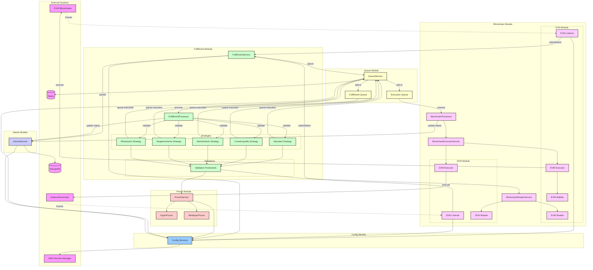

# Blockchain Intent Solver

A high-performance, multi-chain blockchain intent solving system built with NestJS. This system listens for intents on multiple blockchains (EVM and Solana), validates them, and executes fulfillment transactions across chains.

## 🚀 Features

- **Multi-Chain Support**: Multiple EVM networks (Ethereum, Polygon, etc.) and Solana
- **Modular Architecture**: Clean separation of concerns with NestJS modules
- **Queue-Based Processing**: Reliable intent processing with BullMQ and Redis
- **Multiple Fulfillment Strategies**: Standard, CrowdLiquidity, NativeIntents, NegativeIntents, and Rhinestone
- **Pluggable Validation Framework**: Reusable validation classes with immutable configurations
- **On-Chain Funding Verification**: Validates intents are funded on the IntentSource contract before processing
- **Type-Safe Configuration**: Schema-driven configuration with Zod validation
- **AWS Integration**: Secure secrets management with AWS Secrets Manager
- **Docker Ready**: Full containerization support for easy deployment
- **Extensible Design**: Easy to add new chains, fulfillment strategies, and validations
- **REST API**: Quoting API for intent validation and fee calculation

### 🔒 Production-Ready Features

#### Phase 1: Critical Requirements ✅
- **Health Checks**: Comprehensive health monitoring endpoints (`/health`, `/health/live`, `/health/ready`)
- **Global Exception Handling**: Consistent error responses with request tracking
- **Graceful Shutdown**: Proper cleanup of connections and queue jobs on shutdown
- **Security Hardening**: 
  - Helmet for security headers
  - Rate limiting (100 requests/minute by default)
  - CORS configuration
  - API key authentication
- **Request Tracking**: Automatic request ID generation for tracing

#### Phase 2: Observability & Monitoring ✅
- **Structured Logging**: Production-ready Winston logger with:
  - JSON format for machine parsing and log aggregation systems
  - Automatic correlation IDs for request tracing
  - Sensitive data masking (passwords, keys, tokens)
  - Request-scoped and system-level loggers
  - Integration as NestJS's default logger for unified logging
- **Why Winston over NestJS Logger**: 
  - Multiple transports (console, file, HTTP, custom)
  - Structured metadata support for contextual logging
  - Production features: async logging, error handling, query capabilities
  - Enterprise-ready: Works with ELK stack, Splunk, DataDog
  - Extensible with custom formatters and transports
- **Metrics & Monitoring**: DataDog integration with comprehensive metrics:
  - HTTP metrics (request rate, latency, status codes)
  - Queue metrics (job processing time, depth, success/failure rates)
  - Intent metrics (processing time, value distribution, chain-specific)
  - Blockchain RPC metrics (call performance, error rates)
  - Database query performance metrics

#### Phase 2.3: Distributed Tracing ✅
- **OpenTelemetry Integration**: Complete distributed tracing implementation:
  - Automatic HTTP request tracing with correlation IDs
  - Queue job tracing for BullMQ workers
  - MongoDB and Redis instrumentation
  - NestJS framework instrumentation
  - Custom spans for intent processing flow
  - Multiple exporter support (OTLP, Jaeger)
  - Configurable sampling rates
  - Context propagation across services

## 📋 Prerequisites

- Node.js 18+ 
- PNPM 8.15.0 (exact version required)
- Redis 6+
- MongoDB 5+
- Docker & Docker Compose (optional)

## 🛠️ Installation

1. **Clone the repository**
   ```bash
   git clone <repository-url>
   cd blockchain-intent-solver
   ```

2. **Install dependencies**
   ```bash
   pnpm install
   ```

3. **Set up environment variables**
   ```bash
   cp .env.example .env
   # Edit .env with your configuration
   ```
   
   The `.env.example` file contains comprehensive documentation for all configuration options, including detailed explanations and examples.

4. **Start required services**
   ```bash
   # Using Docker Compose
   docker-compose up -d redis mongodb

   # Or install locally
   # - Redis: https://redis.io/download
   # - MongoDB: https://www.mongodb.com/docs/manual/installation/
   ```

## 🏃‍♂️ Running the Application

### Development
```bash
pnpm run start:dev
```

### Production
```bash
pnpm run build
pnpm run start:prod
```

### Docker
```bash
docker-compose up -d
```

## 🏗️ Architecture

### Module Structure

```
src/
├── common/                 # Shared abstractions and interfaces
│   ├── abstractions/      # Base classes for chain listeners and executors
│   ├── constants/         # Application constants
│   └── interfaces/        # TypeScript interfaces (including Intent)
├── config/                # Configuration and validation
│   ├── config.schema.ts   # Zod schema for configuration
│   └── configuration.ts   # Configuration factory
└── modules/               # Core application modules
    ├── api/              # REST API module
    │   └── quotes/       # Quote endpoint for intent validation and fees
    ├── config/           # Configuration module with typed services
    ├── intents/          # Intent persistence and management
    ├── queue/            # Queue management with BullMQ
    ├── blockchain/       # Blockchain integration module
    │   ├── evm/          # EVM-specific implementation
    │   │   ├── listeners/# EVM blockchain event listeners (self-initializing)
    │   │   └── wallets/  # EVM wallet implementations
    │   └── svm/          # Solana-specific implementation
    │       └── listeners/# Solana blockchain event listeners (self-initializing)
    ├── fulfillment/      # Intent validation and fulfillment logic
    │   ├── strategies/   # Multiple fulfillment strategies
    │   └── validations/  # Pluggable validation framework
    └── prover/           # Route validation with multiple prover types
```

### Processing Flow

1. **Listen**: Blockchain listeners (self-initializing) monitor chain events for new intents
2. **Submit**: Listeners call FulfillmentService.submitIntent() for centralized processing
3. **Store**: FulfillmentService persists intents to MongoDB
4. **Queue**: FulfillmentService determines strategy and adds to fulfillment queue
5. **Validate**: Selected strategy validates intents using its immutable validation set
6. **Execute**: Strategy-specific execution logic performs transactions on target chains
7. **Update**: Intent status is updated throughout the process

### Intent Structure

The system uses a structured Intent format with Viem types:

```typescript
interface Intent {
  intentHash: Hex;
  reward: {
    prover: Address;
    creator: Address;
    deadline: bigint;
    nativeValue: bigint;
    tokens: {
      amount: bigint;
      token: Address;
    }[];
  };
  route: {
    source: bigint;        // Source chain ID
    destination: bigint;   // Destination chain ID
    salt: Hex;
    inbox: Address;
    calls: {
      data: Hex;
      target: Address;
      value: bigint;
    }[];
    tokens: {
      amount: bigint;
      token: Address;
    }[];
  };
  status: IntentStatus;
}
```

## 📦 Module Documentation

### API Module (`/modules/api/`)
**Purpose**: Provides REST API endpoints for external systems to interact with the solver

**Components**:
- **Quotes Module**: Quote endpoint for intent validation and fee calculation
  - `POST /api/v1/quotes`: Get a quote for fulfilling an intent
  - Returns validation status, required fees, and strategy information
  - Uses Zod for request validation and BigInt serialization

**Features**:
- Versioned API routes (`/api/v1/*`)
- Strategy-specific fee calculations
- Comprehensive validation results
- BigInt to string serialization for JSON compatibility

### Blockchain Module (`/modules/blockchain/`)
**Purpose**: Handles all blockchain interactions across multiple chains (EVM and Solana)

**Key Services**:
- **BlockchainExecutorService**: Main service for executing blockchain transactions across different chains
- **BlockchainReaderService**: Unified interface for reading blockchain data (balances, token info, contract states)
- **BlockchainProcessor**: Queue processor that handles blockchain execution jobs

**Sub-modules**:
- **EVM Module**: Complete EVM blockchain support including:
  - Multiple network configurations (Ethereum, Polygon, etc.)
  - Self-initializing event listeners for monitoring IntentSource contracts
  - Wallet system with BasicWallet (EOA) and KernelWallet (smart accounts)
  - Transport service for RPC connections
  - Support for batch operations via multicall3
  
- **SVM Module**: Solana blockchain support including:
  - Solana-specific executor and reader implementations
  - Event listener for monitoring Solana programs
  - SPL token support

### Config Module (`/modules/config/`)
**Purpose**: Centralized, type-safe configuration management with AWS Secrets Manager integration

**Features**:
- Schema-driven configuration using Zod for validation
- Automatic environment variable mapping
- AWS Secrets Manager integration for secure credential storage
- Individual configuration services for each domain (App, AWS, Database, EVM, Solana, etc.)
- Deep merging of AWS secrets with local configuration

**Configuration Services**:
- `AppConfigService`: General application settings
- `EvmConfigService`: EVM networks and wallet configurations
- `SolanaConfigService`: Solana network settings
- `FulfillmentConfigService`: Strategy configurations
- `QueueConfigService`: Queue and worker settings
- `DatabaseConfigService`: MongoDB connection
- `RedisConfigService`: Redis connection

### Fulfillment Module (`/modules/fulfillment/`)
**Purpose**: Core business logic for intent validation and fulfillment

**Components**:
- **FulfillmentService**: Main entry point for intent submission (used by all blockchain listeners)
- **FulfillmentProcessor**: Queue processor for validating intents
- **Strategy System**: Pluggable strategies for different fulfillment types:
  - `StandardFulfillmentStrategy`: Default fulfillment logic
  - `CrowdLiquidityFulfillmentStrategy`: Uses crowd-sourced liquidity
  - `NativeIntentsFulfillmentStrategy`: Handles native token transfers
  - `NegativeIntentsFulfillmentStrategy`: Processes reverse intents
  - `RhinestoneFulfillmentStrategy`: Smart account integration

**Validation Framework**: 
Each strategy uses an immutable set of validations including funding checks, route validation, expiration, chain support, and prover validation. All strategies include on-chain funding verification via IntentFundedValidation.

### Intents Module (`/modules/intents/`)
**Purpose**: Manages intent persistence and database operations

**Features**:
- MongoDB schema for intent storage with BigInt support
- CRUD operations for intent management
- Intent status tracking throughout the fulfillment lifecycle
- Conversion utilities for handling different data formats

### Prover Module (`/modules/prover/`)
**Purpose**: Validates intent routes between chains using cryptographic proofs

**Components**:
- **ProverService**: Main service that manages multiple prover implementations
- **Prover Types**:
  - `HyperProver`: For HyperLane-based route validation
  - `MetalayerProver`: For Metalayer protocol validation
- Chain-specific contract configurations for each prover type

### Queue Module (`/modules/queue/`)
**Purpose**: Manages asynchronous job processing with reliability and scalability

**Features**:
- BullMQ integration with Redis backend
- Two main queues:
  - `intent-fulfillment`: For intent validation processing
  - `blockchain-execution`: For executing validated intents
- Standardized job interfaces for consistency
- Automatic retry with exponential backoff
- Centralized queue operations through QueueService

**Queue Flow**:
1. Intent submitted to fulfillment queue with strategy name
2. FulfillmentProcessor validates using strategy's validation set
3. Valid intents queued to execution queue
4. BlockchainProcessor executes on target chain

## 🌐 API Usage

### API Authentication

The API supports optional API key authentication. When API keys are configured, requests must include a valid key:

```bash
# Using header (recommended)
curl -X POST http://localhost:3000/api/v1/quotes \
  -H "Content-Type: application/json" \
  -H "X-API-Key: your-api-key" \
  -d '{"intent": {...}}'

# Using query parameter
curl -X POST "http://localhost:3000/api/v1/quotes?api_key=your-api-key" \
  -H "Content-Type: application/json" \
  -d '{"intent": {...}}'
```

To configure API keys:
```bash
# Single API key
API_KEYS_0=your-secure-api-key

# Multiple API keys
API_KEYS_0=key1
API_KEYS_1=key2
API_KEYS_2=key3
```

If no API keys are configured, the endpoint allows open access (useful for development).

### Quotes Endpoint

The quotes API allows external systems to validate intents and get fee requirements before submission.

**Endpoint**: `POST /api/v1/quotes`

**Request Body**:
```json
{
  "intent": {
    "reward": {
      "prover": "0x1234567890123456789012345678901234567890",
      "creator": "0x1234567890123456789012345678901234567890",
      "deadline": "1735689600",
      "nativeValue": "1000000000000000000",
      "tokens": [
        {
          "amount": "5000000000000000000",
          "token": "0x1234567890123456789012345678901234567890"
        }
      ]
    },
    "route": {
      "source": "1",
      "destination": "10",
      "salt": "0x0000000000000000000000000000000000000000000000000000000000000001",
      "inbox": "0x1234567890123456789012345678901234567890",
      "calls": [
        {
          "target": "0x1234567890123456789012345678901234567890",
          "value": "0",
          "data": "0x"
        }
      ],
      "tokens": [
        {
          "amount": "5000000000000000000",
          "token": "0x1234567890123456789012345678901234567890"
        }
      ]
    }
  },
  "strategy": "standard"  // optional, defaults to configured default strategy
}
```

**Response**:
```json
{
  "valid": true,
  "strategy": "standard",
  "fees": {
    "baseFee": "1000000000000000",
    "percentageFee": "50000000000000",
    "totalRequiredFee": "1050000000000000",
    "currentReward": "5000000000000000000",
    "minimumRequiredReward": "1050000000000000"
  },
  "validations": {
    "passed": [
      "IntentFundedValidation",
      "RouteTokenValidation",
      "RouteCallsValidation",
      "ChainSupportValidation",
      "StandardFeeValidation"
    ],
    "failed": []
  }
}
```

**Error Response**:
```json
{
  "valid": false,
  "strategy": "standard",
  "fees": {
    "baseFee": "1000000000000000",
    "percentageFee": "50000000000000",
    "totalRequiredFee": "1050000000000000",
    "currentReward": "500000000000000",
    "minimumRequiredReward": "1050000000000000"
  },
  "validations": {
    "passed": [
      "RouteTokenValidation",
      "ChainSupportValidation"
    ],
    "failed": [
      {
        "validation": "StandardFeeValidation",
        "reason": "Reward native value 500000000000000 is less than required fee 1050000000000000"
      }
    ]
  }
}
```

## ⚙️ Configuration

The application uses a schema-driven configuration system. See [Configuration Guide](src/modules/config/README.md) for detailed documentation.

### Quick Configuration Example

```bash
# Application
NODE_ENV=development
PORT=3000

# MongoDB
MONGODB_URI=mongodb://localhost:27017/intent-solver

# Redis
REDIS_HOST=localhost
REDIS_PORT=6379

# EVM Configuration
EVM_PRIVATE_KEY=0x...
# Network configuration (arrays)
EVM_NETWORKS_0_CHAIN_ID=1
EVM_NETWORKS_0_RPC_URLS_0=https://eth-mainnet.g.alchemy.com/v2/your-key
EVM_NETWORKS_0_INTENT_SOURCE_ADDRESS=0x...
EVM_NETWORKS_0_INBOX_ADDRESS=0x...
EVM_NETWORKS_0_FEE_LOGIC_BASE_FLAT_FEE=1000000000000000
EVM_NETWORKS_0_FEE_LOGIC_SCALAR_BPS=100

# Solana Configuration
SOLANA_RPC_URL=https://api.mainnet-beta.solana.com
SOLANA_SECRET_KEY=[...]
SOLANA_PROGRAM_ID=...

# Fulfillment Configuration
FULFILLMENT_DEFAULT_STRATEGY=standard
FULFILLMENT_STRATEGIES_STANDARD_ENABLED=true
FULFILLMENT_STRATEGIES_CROWD_LIQUIDITY_ENABLED=true

# AWS Secrets Manager (optional)
# Secrets are automatically fetched when AWS_SECRET_NAME is provided
AWS_REGION=us-east-1
AWS_SECRET_NAME=blockchain-intent-solver-secrets
```

## 💼 Wallet System

The EVM module supports multiple wallet types through a modular architecture:

### Supported Wallet Types

1. **BasicWallet** - Standard EOA (Externally Owned Account)
   - Uses private keys for transaction signing
   - Supports batch operations via multicall3
   - Default wallet type if none specified

2. **KernelWallet** - Smart Account implementation
   - Supports multiple signer types (EOA, KMS)
   - Advanced features like session keys and modules
   - Batch operations via smart contract

### Wallet Configuration

```bash
# Basic wallet (uses global private key by default)
EVM_WALLETS_BASIC_PRIVATE_KEY=0x...  # Optional: override global key

# Kernel wallet with EOA signer
EVM_WALLETS_KERNEL_SIGNER_TYPE=eoa
EVM_WALLETS_KERNEL_SIGNER_PRIVATE_KEY=0x...

# Kernel wallet with AWS KMS signer
EVM_WALLETS_KERNEL_SIGNER_TYPE=kms
EVM_WALLETS_KERNEL_SIGNER_REGION=us-east-1
EVM_WALLETS_KERNEL_SIGNER_KEY_ID=...
```

### Module Architecture

Each wallet type is encapsulated in its own NestJS module:
- `BasicWalletModule` - Provides BasicWalletFactory
- `KernelWalletModule` - Provides KernelWalletFactory

Wallet factories only require a `chainId` to create instances, retrieving all configuration internally.

## 🛡️ Validation Framework

The system includes a comprehensive validation framework that ensures intents are properly validated before execution:

### Available Validations

1. **IntentFundedValidation** - Verifies the intent is funded on the IntentSource contract
3. **RouteTokenValidation** - Validates token addresses in the route
4. **RouteCallsValidation** - Validates call targets and data
5. **RouteAmountLimitValidation** - Enforces route-specific amount limits
6. **ExpirationValidation** - Ensures deadline hasn't passed
7. **ChainSupportValidation** - Verifies source and destination chains are supported
8. **ProverSupportValidation** - Validates the route with configured provers
9. **ExecutorBalanceValidation** - Ensures executor has sufficient funds
10. **Fee Validations** - Strategy-specific fee requirements (Standard, CrowdLiquidity, Native)

### Validation Execution

Each fulfillment strategy defines its own immutable set of validations that are executed sequentially before processing an intent. All strategies include the `IntentFundedValidation` to ensure on-chain funding verification.

### Configurable Validation Parameters

The validation framework supports configurable parameters for different validation types:

```bash
# Route amount limits
FULFILLMENT_VALIDATIONS_ROUTE_LIMITS_DEFAULT=10000000000000000000  # 10 ETH in wei
FULFILLMENT_VALIDATIONS_ROUTE_LIMITS_ROUTES_0_CHAIN_ID=1
FULFILLMENT_VALIDATIONS_ROUTE_LIMITS_ROUTES_0_LIMIT=5000000000000000000  # 5 ETH for chain 1

# Native intent fee parameters
FULFILLMENT_VALIDATIONS_NATIVE_FEE_BASE_FEE=2000000  # Base fee in gwei
FULFILLMENT_VALIDATIONS_NATIVE_FEE_PERCENTAGE_FEE=75  # 0.75% in basis points

# Crowd liquidity fee parameters
FULFILLMENT_VALIDATIONS_CROWD_LIQUIDITY_FEE_BASE_FEE=500000  # Base fee in gwei
FULFILLMENT_VALIDATIONS_CROWD_LIQUIDITY_FEE_PERCENTAGE_FEE=50  # 0.5% in basis points
```

These parameters allow fine-tuning of validation thresholds and fees without code changes.

## 🔧 Development

### Code Style

- **Linting**: `pnpm run lint`
- **Formatting**: `pnpm run format`
- **Type Checking**: Built into the development workflow

### Logging Best Practices

The application uses enhanced Winston logging with custom logger services:

- **LoggerService**: Request-scoped logger for HTTP contexts with automatic correlation IDs
- **SystemLoggerService**: System-level logger for background tasks and non-request contexts

Benefits of using the custom logger services:
- Automatic request correlation ID tracking
- Sensitive data masking (passwords, keys, tokens)
- Structured JSON logging with metadata
- Context-aware logging for better filtering

Example usage:
```typescript
// For HTTP request contexts
constructor(private readonly logger: LoggerService) {
  this.logger.setContext(MyService.name);
}

// For background services
constructor(private readonly logger: SystemLoggerService) {
  this.logger.setContext(MyService.name);
}
```

### Observability Usage

#### DataDog Metrics (Optional)

DataDog integration is optional and disabled by default. To enable DataDog metrics:

```bash
# Enable DataDog metrics
DATADOG_ENABLED=true

# DataDog Agent configuration (defaults shown)
DATADOG_HOST=localhost
DATADOG_PORT=8125
DATADOG_PREFIX=blockchain_intent_solver.

# Optional global tags
DATADOG_GLOBAL_TAGS_ENV=production
DATADOG_GLOBAL_TAGS_SERVICE=blockchain-intent-solver
```

When enabled, metrics are automatically sent via StatsD protocol and include:
- **HTTP Metrics**: `http.requests.total`, `http.request.duration`, `http.errors.*`
- **Queue Metrics**: `queue.jobs.total`, `queue.job.duration`, `queue.depth`
- **Intent Metrics**: `intents.processed.total`, `intent.processing.duration`, `intent.value.usd`
- **Blockchain RPC Metrics**: `blockchain.rpc.calls.total`, `blockchain.rpc.duration`
- **Database Metrics**: `database.query.duration`

All metrics include relevant tags for filtering (e.g., `method`, `route`, `chain`, `status`)

#### OpenTelemetry Distributed Tracing (Optional)

Enable distributed tracing to monitor request flows across services:

```bash
# Enable OpenTelemetry
OPENTELEMETRY_ENABLED=true

# OTLP Exporter (default)
OPENTELEMETRY_OTLP_ENDPOINT=http://localhost:4318
OPENTELEMETRY_OTLP_PROTOCOL=http  # or grpc

# Or use Jaeger
OPENTELEMETRY_JAEGER_ENABLED=true
OPENTELEMETRY_JAEGER_ENDPOINT=http://localhost:14268/api/traces

# Sampling configuration
OPENTELEMETRY_SAMPLING_RATIO=1.0  # 100% sampling for development
```

**Features**:
- **Automatic Instrumentation**: HTTP, MongoDB, Redis, and NestJS are automatically instrumented
- **Queue Tracing**: BullMQ jobs are traced with parent-child span relationships
- **Context Propagation**: Trace context flows through the entire request lifecycle
- **Custom Spans**: Intent processing includes custom spans for detailed visibility
- **Multiple Exporters**: Support for OTLP (compatible with many backends) and Jaeger

**Running with Jaeger**:
```bash
# Start Jaeger
docker run -d --name jaeger \
  -p 16686:16686 \
  -p 14268:14268 \
  -p 4318:4318 \
  jaegertracing/all-in-one:latest

# View traces at http://localhost:16686
```

#### Structured Logs
```bash
# View logs with pretty printing
tail -f logs/application-*.log | jq '.'

# Filter by request ID
tail -f logs/application-*.log | jq 'select(.requestId == "abc-123")'

# Filter by log level
tail -f logs/application-*.log | jq 'select(.level == "error")'

# Example log entry:
{
  "level": "info",
  "message": "Intent validated successfully",
  "timestamp": "2025-08-08 10:30:00",
  "context": "StandardFulfillmentStrategy",
  "requestId": "abc-123",
  "data": {
    "intentId": "0x123...",
    "sourceChain": "1",
    "destinationChain": "10"
  }
}
```

### Testing

Tests are organized in `tests` folders within each module directory, keeping tests close to the code they test.

```bash
# Unit tests
pnpm run test

# Test coverage
pnpm run test:cov

# E2E tests
pnpm run test:e2e
```

**Test Structure Example:**
```
src/modules/fulfillment/
├── strategies/
│   ├── tests/                    # Strategy tests
│   │   └── *.spec.ts
│   └── *.strategy.ts
└── validations/
    ├── tests/                    # Validation tests
    │   └── *.spec.ts
    ├── test-helpers.ts           # Shared test utilities
    └── *.validation.ts
```

**Test Utilities:**
The validation tests use a centralized `createMockIntent` helper function from `test-helpers.ts` for creating consistent mock intent objects. This improves maintainability and ensures all tests use properly structured intent data.

### Adding a New Chain

1. Create a new listener extending `BaseChainListener`:
   ```typescript
   export class MyChainListener extends BaseChainListener {
     constructor(
       private myChainConfig: MyChainConfigService,
       private fulfillmentService: FulfillmentService,
       private fulfillmentConfigService: FulfillmentConfigService,
     ) {
       super();
     }
     // Implement abstract methods
   }
   ```

2. Create a new executor extending `BaseChainExecutor`:
   ```typescript
   export class MyChainExecutor extends BaseChainExecutor {
     // Implement abstract methods
   }
   ```

3. Register in blockchain module with FulfillmentModule import (use forwardRef if needed)

### Adding New Configuration

1. Update the Zod schema in `src/config/config.schema.ts`
2. Create a typed configuration service
3. Environment variables are automatically mapped from the schema

See [Configuration Guide](src/modules/config/README.md) for details.

## 🚀 Deployment

### Docker Deployment

```bash
# Build the image (Dockerfile is in docker/ directory)
docker build -t blockchain-intent-solver -f docker/Dockerfile .

# Run with docker-compose
docker-compose up -d
```

### AWS ECS/Kubernetes

The application is designed to run in containerized environments:
- Stateless design allows horizontal scaling
- Graceful shutdown handling
- Environment-based configuration

### Production Considerations

1. **Secrets Management**: Use AWS Secrets Manager for sensitive data
2. **Monitoring**: Implement logging and metrics collection
3. **High Availability**: Run multiple instances with Redis for queue coordination
4. **Database**: Use MongoDB replica sets for reliability
5. **Security**: 
   - Never expose private keys in logs
   - Use least-privilege IAM roles
   - Enable SSL/TLS for all connections

## 📚 Documentation

- [Configuration Guide](src/modules/config/README.md) - Detailed configuration documentation
- [CLAUDE.md](../CLAUDE.md) - Project guidelines and conventions
- [API Documentation](docs/api.md) - Coming soon

## 🤝 Contributing

1. Follow the coding standards in [CLAUDE.md](../CLAUDE.md)
2. Write tests for new features
3. Update documentation as needed
4. Submit PR with clear description

## 📄 License

MIT

## 🔗 Related Resources

- [NestJS Documentation](https://docs.nestjs.com/)
- [BullMQ Documentation](https://docs.bullmq.io/)
- [Viem Documentation](https://viem.sh/)
- [Solana Web3.js](https://solana-labs.github.io/solana-web3.js/)

## 🐛 Troubleshooting

### Common Issues

1. **Redis Connection Failed**
   - Ensure Redis is running: `redis-cli ping`
   - Check `REDIS_HOST` and `REDIS_PORT` in configuration

2. **MongoDB Connection Failed**
   - Verify MongoDB is running: `mongosh --eval "db.version()"`
   - Check `MONGODB_URI` format and credentials

3. **Configuration Validation Error**
   - Review error message for missing/invalid configuration
   - Check environment variables match schema requirements
   - See [Configuration Guide](src/modules/config/README.md)

4. **Queue Processing Issues**
   - Check Redis connection
   - Verify queue names match between producers and consumers
   - Review logs for processing errors

### Debug Mode

Enable debug logging:
```bash
DEBUG=* pnpm run start:dev
```

## 📞 Support

For issues and questions:
- Check existing issues in the repository
- Review documentation thoroughly
- Create a new issue with detailed information

## 🔄 Module Interaction Diagram

The following diagram illustrates how the different modules interact with each other in the intent processing flow:



### Key Interaction Patterns:

1. **Event Detection**: Blockchain listeners (EVM/SVM) monitor on-chain events and submit intents to the FulfillmentService
2. **Centralized Processing**: All intents flow through FulfillmentService for consistent handling
3. **Strategy Selection**: FulfillmentService determines the appropriate strategy based on configuration
4. **Validation Flow**: Each strategy uses its own set of validations, which may interact with BlockchainReaderService and ProverService
5. **Queue Management**: QueueService manages both fulfillment and execution queues with Redis backing
6. **Execution**: BlockchainProcessor delegates to BlockchainExecutorService, which uses chain-specific executors
7. **Configuration**: All modules depend on Config Module for typed configuration access
8. **Persistence**: IntentsService manages all database operations for intent storage and status updates