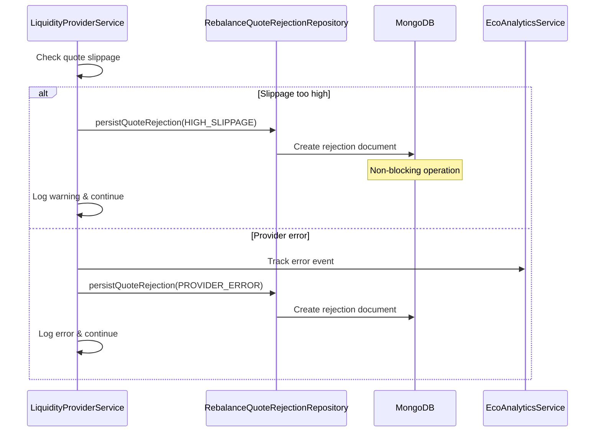

# Rejected Rebalance Quotes Persistence Plan

## Overview

This plan implements a systematic solution for persisting rejected rebalance quotes to enable data-driven analysis of quote failures, provider performance, and route optimization.

## Problem Statement

Currently, rejected rebalance quotes are only logged transiently, making it impossible to:
- Track provider reliability patterns
- Analyze slippage tolerance effectiveness  
- Identify problematic token pairs or routes
- Perform systematic analysis of quote failures
- Fine-tune strategies based on historical rejection data

## Architecture Analysis

Based on the architectural agent's analysis:
- **Architecture Score**: 85/100
- **Style**: Modular Monolith with Domain-Driven Design
- **Integration Points**: 
  - `LiquidityProviderService.getQuote()` lines 80-100 (HIGH_SLIPPAGE) - move logging to repository
  - `LiquidityProviderService.getQuote()` lines 103-126 (PROVIDER_ERROR) - move logging to repository

## Solution Design

### 1. Database Schema

**Collection**: `rebalancequoterejectionmodels`

**Schema Location**: `src/liquidity-manager/schemas/rebalance-quote-rejection.schema.ts`

#### Fields:
- `rebalanceId`: string (UUID from quoteId)
- `strategy`: Strategy enum (LiFi, Stargate, CCTP, etc.)
- `reason`: RejectionReason enum (HIGH_SLIPPAGE, PROVIDER_ERROR, etc.)
- `tokenIn`: RebalanceTokenModel (reuses existing schema)
- `tokenOut`: RebalanceTokenModel (reuses existing schema)
- `swapAmount`: number
- `details`: Object (flexible context data)
- `walletAddress`: string (optional)
- `createdAt/updatedAt`: timestamps (auto-generated)

#### Indexes:
- `{ rebalanceId: 1 }`
- `{ strategy: 1, reason: 1 }`
- `{ 'tokenIn.chainId': 1, 'tokenOut.chainId': 1 }`
- `{ createdAt: -1 }`

### 2. Repository Pattern

#### Rebalance Quote Rejection Repository
**Location**: `src/liquidity-manager/repositories/rebalance-quote-rejection.repository.ts`

**Core Methods**:
- `create(rejectionData)`: Persist rejection with error handling and logging
- `hasRejectionsInLastHour()`: Check if any rejections occurred in last hour (for health monitoring)
- `getRecentRejectionCount(timeRange)`: Get count of rejections in time range (for health monitoring)

#### Rebalance Repository (New)
**Location**: `src/liquidity-manager/repositories/rebalance.repository.ts`

**Core Methods**:
- `create(rebalanceData)`: Persist successful rebalance with logging
- `createBatch(walletAddress, quotes, groupId)`: Persist multiple rebalances (moved from LiquidityManagerService)
- `hasSuccessfulRebalancesInLastHour()`: Check for successful rebalances in last hour (for health monitoring)
- `getRecentSuccessCount(timeRange)`: Get count of successful rebalances in time range (for health monitoring)

#### Rebalancing Health Repository (New)
**Location**: `src/liquidity-manager/repositories/rebalancing-health.repository.ts`

**Core Methods**:
- `checkRebalancingHealth()`: Main health check logic combining success/failure data
- `getHealthStatus()`: Returns health status with detailed metrics
- `isSystemHealthy()`: Boolean health check for health indicator
- `getHealthMetrics(timeRange)`: Detailed health metrics for monitoring

**Health Logic**:
- Aggregates data from both rebalance and rejection repositories
- Implements rolling counter logic for success vs failure rates
- Marks system as DOWN if rejections in last hour AND no successful rebalances
- Contains all health-related business logic and tests

#### Logging Strategy:
- Repositories handle all persistence logging (moved from service layer)
- Service layer focuses on business logic only
- Centralized logging in repositories ensures consistency

### 3. Service Integration

**Modified Files**:
- `src/liquidity-manager/services/liquidity-provider.service.ts`
- `src/liquidity-manager/services/liquidity-manager.service.ts` 
- `src/liquidity-manager/liquidity-manager.module.ts`

#### Integration Strategy:
- **Non-blocking**: Persistence failures don't break quote operations
- **Async**: Database operations run in parallel with main flow
- **Graceful degradation**: Warnings logged but processing continues

## Implementation Plan

### Phase 1: Foundation (Schema + Repositories)
**Estimated Time**: 3-4 hours

#### Tasks:
1. **Create Rejection Reason Enum**
   - Location: `src/liquidity-manager/schemas/rebalance-quote-rejection.schema.ts`
   - Values: `HIGH_SLIPPAGE`, `PROVIDER_ERROR`, `INSUFFICIENT_LIQUIDITY`, `TIMEOUT`

2. **Create Rebalance Quote Rejection Schema**
   - Extend existing patterns from `RebalanceModel`
   - Reuse `RebalanceTokenModel` for token data consistency
   - Add strategic indexes for query performance

3. **Implement Rebalance Quote Rejection Repository**
   - Follow existing repository patterns
   - Include error handling and logging
   - Add health monitoring methods

4. **Create Rebalance Repository** 
   - Move `RebalanceModel` operations from `LiquidityManagerService`
   - Implement `create()` and `createBatch()` methods
   - Add health monitoring methods for successful rebalances
   - Include error handling and logging

5. **Create Rebalancing Health Repository**
   - Implement all health check business logic
   - Inject both `RebalanceRepository` and `RebalanceQuoteRejectionRepository`
   - Implement rolling counter and health status logic
   - Include comprehensive health metrics and reporting

6. **Write Unit Tests**
   - Schema validation tests
   - All repository CRUD operation tests
   - Error handling scenarios
   - Comprehensive health logic tests (in rebalancing health repository)
   - Health calculation edge cases and scenarios

### Phase 2: Service Integration (Core Logic)
**Estimated Time**: 3-4 hours

#### Tasks:
1. **Modify LiquidityProviderService Constructor**
   - Inject `RebalanceQuoteRejectionRepository`
   - Maintain existing dependency structure

2. **Modify LiquidityManagerService Constructor**
   - Replace direct `RebalanceModel` injection with `RebalanceRepository`
   - Update `storeRebalancing` method to use repository

3. **Create Private Persistence Method in LiquidityProviderService**
   ```typescript
   private async persistQuoteRejection(
     rebalanceId: string,
     strategy: Strategy,
     reason: RejectionReason,
     tokenIn: TokenData,
     tokenOut: TokenData,
     swapAmount: number,
     details?: any,
     walletAddress?: string,
   ): Promise<void>
   ```

4. **Enhance HIGH_SLIPPAGE Handling** (Lines 80-100)
   - Move logging to repository layer
   - Add rejection persistence with slippage details
   - Include quotes data in details object

5. **Enhance PROVIDER_ERROR Handling** (Lines 103-126)
   - Move logging to repository layer
   - Maintain existing analytics tracking
   - Add rejection persistence with error details
   - Include error message, code, and stack trace

6. **Update LiquidityManagerService.storeRebalancing** (Lines 190-205)
   - Replace direct model usage with repository
   - Move logging to repository layer

7. **Add Fallback Method Enhancement**
   - Extend existing fallback rejection logic
   - Add persistence for fallback failures

8. **Write Integration Tests**
   - Test HIGH_SLIPPAGE persistence
   - Test PROVIDER_ERROR persistence  
   - Test successful rebalance persistence
   - Test non-blocking behavior on DB failures

### Phase 3: Module Registration (Activation)
**Estimated Time**: 1 hour

#### Tasks:
1. **Update LiquidityManagerModule**
   - Add rejection schema to MongooseModule.forFeature()
   - Register all three repositories in providers array
   - Export repositories if needed by other modules (especially health repository)
   - Remove direct RebalanceModel export if not needed elsewhere

2. **Update Module Imports**
   - Ensure all required dependencies are imported
   - Verify module initialization order

3. **Write Module Tests**
   - Verify proper module registration
   - Test dependency injection for all three repositories

### Phase 4: Health Monitoring Integration
**Estimated Time**: 2-3 hours

#### Tasks:
1. **Create Simple Rebalance Health Indicator**
   - Location: `src/health/indicators/rebalance-health.indicator.ts`
   - Implement `HealthIndicator` interface
   - Inject only `RebalancingHealthRepository`
   - Simple delegation to repository's `isSystemHealthy()` method
   - Minimal logic - all business logic in repository

2. **Integrate with Health Module**
   - Add `RebalanceHealthIndicator` to `health.module.ts`
   - Register in health check endpoint
   - Configure check frequency and thresholds
   - Import `LiquidityManagerModule` for repository access

3. **Write Health Indicator Tests**
   - Simple delegation tests
   - Mock repository responses
   - Verify health endpoint integration

4. **Add Analytics Event for Health**
   - `ANALYTICS_EVENTS.LIQUIDITY_MANAGER.QUOTE_REJECTION_PERSISTENCE_ERROR`
   - Track DB persistence failures only

## File Structure

```
src/liquidity-manager/
├── schemas/
│   ├── rebalance.schema.ts (existing)
│   ├── rebalance-token.schema.ts (existing)
│   └── rebalance-quote-rejection.schema.ts (new)
├── repositories/
│   ├── rebalance-quote-rejection.repository.ts (new)
│   ├── rebalance.repository.ts (new)
│   └── rebalancing-health.repository.ts (new)
├── services/
│   ├── liquidity-provider.service.ts (modify)
│   └── liquidity-manager.service.ts (modify)
├── tests/
│   ├── rebalance-quote-rejection.repository.spec.ts (new)
│   ├── rebalance.repository.spec.ts (new)
│   ├── rebalancing-health.repository.spec.ts (new)
│   ├── liquidity-provider.service.spec.ts (modify)
│   └── liquidity-manager.service.spec.ts (modify)
└── liquidity-manager.module.ts (modify)

src/health/indicators/
└── rebalance-health.indicator.ts (new)
```

## Data Flow



## Risk Mitigation

### Database Performance
- **Risk**: High-volume rejections impact DB performance
- **Mitigation**: Strategic indexing, async operations, optional batching

### Service Reliability  
- **Risk**: DB failures break quote operations
- **Mitigation**: Non-blocking persistence, graceful error handling

### Data Consistency
- **Risk**: Missing rejections due to service failures  
- **Mitigation**: Analytics tracking of persistence failures, retry mechanisms

### Schema Evolution
- **Risk**: Future changes break existing queries
- **Mitigation**: Versioned schemas, backward compatibility

## Success Metrics

### Technical Metrics
- [ ] Zero impact on quote operation performance
- [ ] <1% persistence failure rate
- [ ] Query response time <100ms for analytics
- [ ] 100% test coverage for new components

### Business Metrics  
- [ ] Ability to identify top 3 failing providers
- [ ] Track slippage tolerance effectiveness
- [ ] Measure route success rates by token pair
- [ ] Generate weekly rejection analysis reports

## Acceptance Criteria

### Phase 1 Completion
- [ ] RebalanceQuoteRejectionModel schema created and tested
- [ ] Repository implements full CRUD operations
- [ ] Unit tests achieve 100% coverage
- [ ] Schema follows existing codebase patterns

### Phase 2 Completion  
- [ ] HIGH_SLIPPAGE rejections persisted with slippage details
- [ ] PROVIDER_ERROR rejections persisted with error context
- [ ] Existing logging and analytics behavior unchanged
- [ ] Integration tests verify non-blocking behavior

### Phase 3 Completion
- [ ] Module properly registers new schema and repository
- [ ] Dependency injection works correctly
- [ ] Application starts without errors

### Phase 4 Completion
- [ ] RebalancingHealthRepository created with all health logic and tests
- [ ] Simple RebalanceHealthIndicator delegates to repository
- [ ] Health check marks DOWN based on repository logic
- [ ] Health endpoint includes rebalance status
- [ ] All health business logic centralized in repository layer

## Rollback Strategy

### Immediate Rollback
- Remove repository injection from service constructor
- Comment out persistence method calls
- Revert module registration changes

### Data Cleanup
- MongoDB collection can be dropped safely
- No migration scripts required for rollback
- Existing log-based analysis remains functional

## Future Enhancements

### Enhanced Health Monitoring
- Configurable rejection thresholds (not just 1 hour)
- Strategy-specific health indicators
- Integration with alerting systems (PagerDuty, Slack)

### External Analytics Integration
- Export data to external analytics platform
- Real-time dashboards in external tools
- Automated reporting and insights

### Advanced Health Logic
- Rolling success/failure ratios
- Weighted health scores by provider reliability
- Predictive health degradation alerts

## Dependencies

### Required Libraries
- `@nestjs/mongoose` (existing)
- `mongoose` (existing)  
- `uuid` (existing)
- `viem` (existing)

### Required Services
- `EcoConfigService` (existing)
- `EcoAnalyticsService` (existing)
- `RebalanceTokenModel` (existing)

### Database Requirements
- MongoDB with mongoose connection
- Proper indexing strategy
- Backup/recovery procedures

## Implementation Notes

### Code Quality Standards
- Follow existing ESLint/Prettier configurations
- Maintain TypeScript strict mode compliance
- Use existing logging patterns (EcoLogMessage)
- Follow DRY principles for repeated logic

### Security Considerations
- No sensitive data in rejection records
- Proper input validation for schema fields
- Rate limiting for analytics queries
- Audit trail for data access

### Performance Optimizations
- Lazy loading for analytics queries
- Connection pooling for DB operations
- Caching for frequently accessed rejection stats
- Bulk operations for high-volume scenarios

This plan provides a comprehensive roadmap for implementing systematic rejection tracking while maintaining the existing system's reliability and performance characteristics.